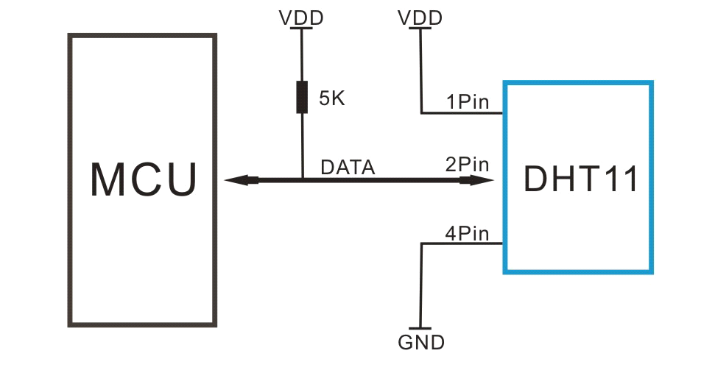

## Wiring DHT11

Check data definition:\
8bit Humidity integer data + 8bit Humidity fraction data + 8bit Temperature integer data + 8bit Temperature fraction data”.The 8 bit check bit is equal to the last 8 bits of the result.

The received 40 bits of data are\
Humidity_High + Humidity_Low + Temperature_High + Temperature_Low = Check_Sum\

## ESP32
Flash MicroPython Firmware with esptool.py or uPyCraft (problem with zlib in my case)\
Flash memory: `python3 -m esptool --chip esp32 erase_flash`\
Flashing MicroPython Firmware: `python3 -m esptool --chip esp32 --port <serial_port> write_flash -z 0x1000 <esp32-X.bin>`\

## InfluxDB
Time series database client will be use to capture data from sensors and allows to visualize them easily.\
There is no official InfluxDB C language client library. But here is some solution from IBM: https://github.com/nigelargriffiths/InfluxDB-C-client\

